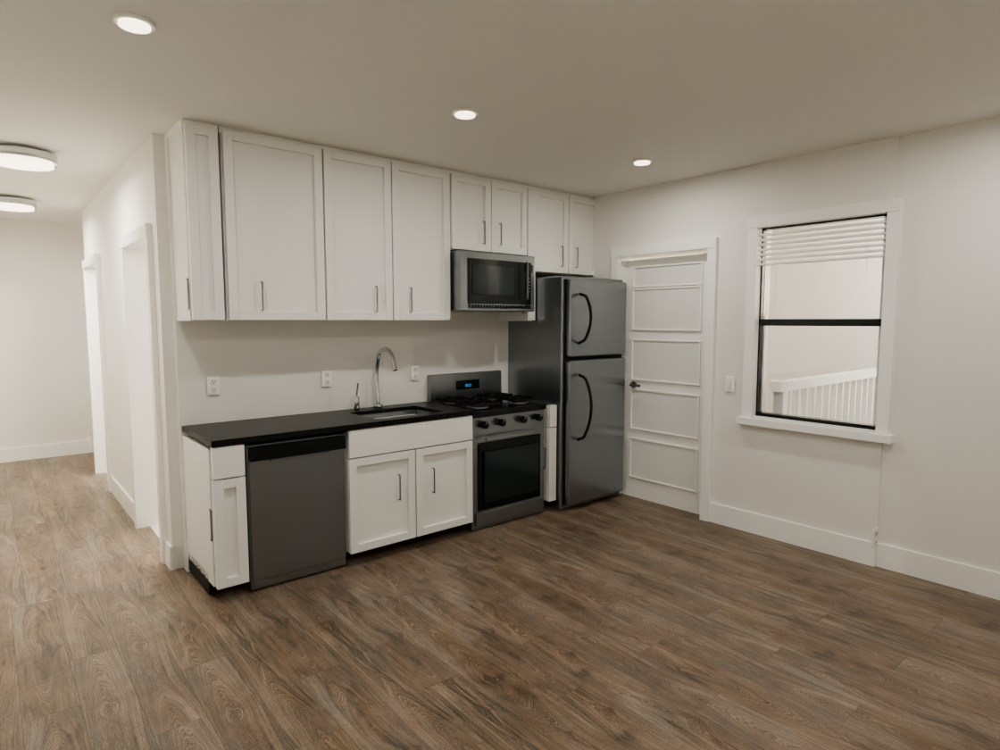

# Apartment from photos

A four-bedroom apartment reconstructed from **12 interior photos and a floor plan**, modeled and rendered in Blender, and made explorable in the browser. Built by [Dylan Szeto](https://x.com/dylan_szeto) with AI assistance.

The experiment: can a small set of listing photos make a layout easier to understand before an in-person visit?



**[Open the live walkthrough](https://california-unit-4-trim-projects.vercel.app/)** · **[GitHub source](https://github.com/dylanxzthomas/california-unit-4)**

## Explore

- **Rendered tour:** 11 Blender Cycles panoramas. Drag to look, scroll to zoom, and select room markers to move between fixed viewpoints.
- **Free walk:** continuous movement through the same model, plus dollhouse and top views. Uses baked diffuse lighting and HDR reflection captures.
- Compare against the source photos and complete floor plan. Download the editable Blender model inside **Model notes**.

## Run locally

Node.js 22.13 or newer in the Node 22 series.

```sh
npm ci
npm run dev
```

```sh
npm run build
npm run preview
npm run validate
```

Deploy on Vercel with the Vite preset. The included configuration builds to `dist`; no environment variables, API keys, database, or Blender installation are required to run the website.

## How it works

React and Three.js handle the interface and navigation. Blender Cycles supplies the daylight-rendered panoramas, four diffuse lightmaps, and three HDR reflection captures. The web geometry is a losslessly compressed GLB, decompressed in the browser. The rendered tour loads one viewpoint at a time; Free walk loads the larger model and lighting assets when selected.

The project is a manual reconstruction guided by the photos and plan, not an automated scan. Sunlight and bounced light were rendered in Blender; the browser's continuous mode approximates some glass and reflections for responsiveness.

## Source layout

- `app/`: interface and styles
- `lib/tour-scene.ts`: panorama viewer
- `lib/detailed-scene.ts`: continuous 3D viewer
- `lib/navigation.ts`: room connections and collision constraints
- `public/daylight-tour/`: 11 rendered viewpoints
- `public/models/`: downloadable Blender project and web assets
- `public/references/`: supplied photos and plans
- `blender/`: editable source, modeling/rendering scripts, and evidence notes
- `scripts/`: asset and navigation validation

See [Blender workflow](blender/README.md) and [model evidence](blender/FULL_UNIT_EVIDENCE.md). The rendering scripts use the original Mac Metal setup; choose your own Cycles device on other platforms.

## Accuracy

2861 California Street, Unit 4. Reported details: 4 bedrooms, 2 bathrooms, 1,140 square feet. The plan establishes room connections; dimensions, some photo assignments, exterior scenery, and sun direction are inferred. This is not a measured survey, a solar study, or a photogrammetry scan. Panorama transitions are fades between fixed positions, not a continuously moving camera.

Source photographs and the plan were supplied for this project; their inclusion is not a grant of reuse rights. No blanket license is asserted for third-party source materials.

## Deployment notes

The production release is hosted in the `trim-projects` Vercel workspace. The initial deployment was submitted through the Vercel connector and built from a pinned public GitHub commit. Git pushes do not automatically redeploy this project yet. To enable that workflow, connect this repository in the Vercel project’s Git settings and use its Vite configuration.
